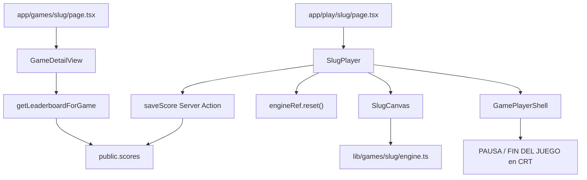

# Reference — game integration patterns (SPEC 05 + SPEC 06)

Read this file when filling the unified spec template. Also read `.claude/skills/spec/SKILL.md` and `.claude/skills/spec/template.md` first — they govern how the spec document is written; this file governs what game-integration content goes in it.

---

## Reference folder → catalog id

| Reference folder | Catalog `id` | Platform title | Status |
|------------------|--------------|----------------|--------|
| `references/started-games/02-asteroids/` | `asteroids` | ASTEROIDS | Implemented (gold standard) |
| `references/started-games/03-tetris/` | `caida` | CAÍDA | Placeholder in catalog |
| `references/started-games/04-arkanoid/` | `bloque-buster` | BLOQUE BUSTER | Placeholder in catalog |

Folder number (`02`, `03`, `04`) is arbitrary — always resolve by game name, not by assuming sequential mapping to catalog order.

---

## Gold standard file tree (Asteroids)

```
app/
  data/
    static-game-routes.ts       # STATIC_GAME_ROUTES, hasStaticGameRoute()
  games/
    asteroids/page.tsx          # GameDetailView
  play/
    asteroids/page.tsx          # AsteroidsPlayer

components/
  game-detail-view.tsx          # shared detail UI
  game-player.tsx               # placeholder for unimplemented games
  game-player-shell.tsx         # HUD + CRT + pause/game over overlays
  games/
    asteroids-canvas.tsx
    asteroids-player.tsx

lib/games/asteroids/
  types.ts
  constants.ts
  utils.ts
  engine.ts
  entities/
    bullet.ts, asteroid.ts, ship.ts, particle.ts, power-up.ts

lib/data/leaderboard.ts         # SUPABASE_GAMES branching
lib/player-name.ts              # usePlayerName(), writePlayerName()
app/actions/save-score.ts       # generic insert (reuse per game)
app/actions/leaderboard.ts      # client-safe reads for hall-of-fame

app/arcade-vault.css            # .cover-asteroids, .crt-gameover-*

supabase/migrations/
  20260804_games_scores.sql     # schema + seed asteroids
  20260804_scores_disable_rls.sql
```

---

## Engine API contract

From `lib/games/asteroids/types.ts`:

```ts
export type AsteroidsPhase = "playing" | "dead" | "gameover";

export interface AsteroidsGameState {
  score: number;
  lives: number;
  level: number;
  phase: AsteroidsPhase;
}

export interface AsteroidsEngine {
  mount(canvas: HTMLCanvasElement): void;
  unmount(): void;
  pause(): void;
  resume(): void;
  reset(): void;
  onStateChange(cb: (state: AsteroidsGameState) => void): () => void;
}
```

Adapt `{Pascal}GameState` fields per game (e.g. Tetris may omit `lives`, add `lines`).

---

## React integration patterns (file paths only)

| Concern | File | Key pattern |
|---------|------|-------------|
| Canvas mount | `components/games/asteroids-canvas.tsx` | `useEffect` mount/unmount; `onStateChangeRef` updated in separate `useEffect` (React 19) |
| Player state | `components/games/asteroids-player.tsx` | `score`, `lives`, `level`, `paused`, `over`, `saved`, `saveError`, `initials` |
| Save score | `components/games/asteroids-player.tsx` | `saveScore({ gameId, playerName, score })` → `writePlayerName()` on success |
| Shell | `components/game-player-shell.tsx` | `arena` prop; `saveError` optional; game over inside `.crt-screen` |
| Static routes | `app/play/asteroids/page.tsx` | `getGameById("asteroids")` → `<AsteroidsPlayer game={…} />` |
| Route registry | `app/data/static-game-routes.ts` | Exclude static ids from `[id]/generateStaticParams` |

---

## Leaderboard flow (SPEC 06)

### Save (client → server → Supabase)

```
{Pascal}Player (client)
  → saveScore() Server Action (app/actions/save-score.ts)
    → createClient() server (publishable key)
    → validate gameId / playerName / score
    → INSERT public.scores (RLS off)
  → ok: writePlayerName() + toast
  → error: setSaveError() → GamePlayerShell shows magenta text
```

### Read (hybrid mock vs Supabase)

```
Server Component (game-detail-view)
  → getLeaderboardForGame() in lib/data/leaderboard.ts
    → Supabase if id ∈ SUPABASE_GAMES, else seededScores mock

Client Component (hall-of-fame)
  → fetchLeaderboardForGame() / fetchPlayerBestForGame()
    → app/actions/leaderboard.ts → same branching
```

### Per-game Supabase checklist (no new infrastructure)

1. SQL seed: `insert into public.games (…) values (…)` — same strings as `games.ts`
2. Add slug to `SUPABASE_GAMES` in `lib/data/leaderboard.ts`
3. Wire `{Pascal}Player` to `saveScore` + `usePlayerName()`

**Do not duplicate:** `save-score.ts`, `getLeaderboard`, RLS migrations.

### Player name

- Key: `av_player_name` (`lib/player-name.ts`)
- Prefill priority: `localStorage` → auth mock `user.name` → `"INVITADO"`
- Normalization: trim, uppercase, 1–10 characters

---

## Inherited defaults (pre-fill in spec unless user overrides)

| Topic | Default |
|-------|---------|
| Integration | Static route + dedicated player (no `GamePlayer` branch) |
| Game over UI | Overlay `.crt-gameover` inside CRT shell |
| Engine game over | `phase === "gameover"` — no "GAME OVER" text on canvas |
| Input | Decouple from entities (e.g. `Ship.input` assigned by engine each frame) |
| Pause | `pause()` cancels rAF; canvas receives `paused \|\| over` |
| Leaderboard | Real Supabase for this game (`SUPABASE_GAMES`) |
| Save trigger | Manual — **GUARDAR PUNTUACIÓN** button only |
| `user_id` | Always `null` (no Supabase Auth in scope) |
| RLS on `scores` | Disabled (course pattern; Server Action + publishable key) |
| Canvas default | 800×600 (Asteroids); read from reference if different |
| Controls default | Keyboard only unless reference or user specifies otherwise |

---

## Anti-patterns (document as "No hacer" in spec)

- `if (game.id === "…")` in `components/game-player.tsx`
- Generic engine registry (`Record<string, GameEngine>`) — defer until pain is real
- "GAME OVER" overlay drawn by the engine on canvas
- Direct `supabase.from("scores").insert()` from browser client
- New Server Action per game for score insert
- New RLS migration per game (unless reverting global pattern)
- Auto-save on `gameover` without button press
- Marking spec as `Aprobado` automatically

---

## Porting from reference (`references/started-games/`)

Analysis steps for the spec (not code):

1. Read `game.js` — list classes (`Bullet`, `Asteroid`, …), globals (`score`, `lives`, `level`, `state`)
2. Read `README.md` — controls, scoring table, features
3. Read `index.html` — canvas dimensions
4. Check for `levels.js`, `style.css`, `assets/` — note what must be ported
5. Map reference globals → engine closure + `entities/` split
6. Identify internal HUD drawn in `draw()` — keep in canvas, sync via `onStateChange`
7. Note audio — default **out of scope** unless user requests

### Asteroids reference entities (example)

From `references/started-games/02-asteroids/game.js`:

- Classes: `Bullet`, `Asteroid`, `Ship`, `Particle`, `PowerUp`
- Canvas: 800×600, toroidal wrap
- State: `playing | dead | gameover`
- Power-up: triple shot (optional — confirm for other games)

---

## Layer diagram (mermaid)



---

## Environment (leaderboard — no per-game changes)

```env
NEXT_PUBLIC_SUPABASE_URL=…
NEXT_PUBLIC_SUPABASE_PUBLISHABLE_KEY=…
# SUPABASE_SERVICE_ROLE_KEY — NOT used by save-score
```

---

## Relationship to source specs

| Pattern | Source |
|---------|--------|
| Engine, routes, shell, static routes | `specs/05-asteroids.md` — "Patrón de integración", "Implementación final" |
| Supabase seed, SUPABASE_GAMES, saveScore | `specs/06-games-leaderboard-supabase.md` — "Patrón replicable" |
| Acceptance criteria structure | Both specs — merge gameplay (05) + leaderboard (06) |

When in doubt, read the implemented code over the original spec draft (both specs have "Implementación final" sections documenting deviations).
